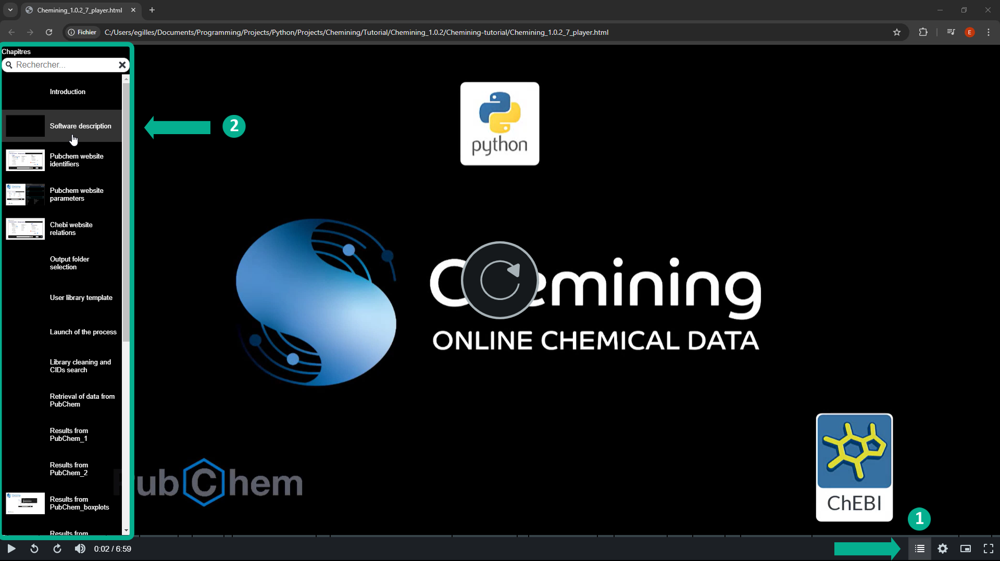

Chemining is an automated and user-friendly tool to retrieve a large amount of data from the PubChem and ChEBI websites. From only compounds name (SMILES and molecular formula) checked by Chemining, numerous identifiers, parameters and the ontology of these compounds are extracted and delivered in Excel format.\
\
Click on the following link to download the [installation file](https://github.com/scannotation/Chemining_software/blob/main/Chemining_1.0.2-setup.exe) "Chemining_1.0.2-setup.exe".\
For more information, view the [video tutorial](https://github.com/scannotation/Chemining_software/blob/main/Chemining-tutorial.zip).

## Development
Chemining was developed in Python 3.9 on Windows 10.

## Tutorial
Please download the zip folder "Chemining-tutorial.zip" to view the [video tutorial](https://github.com/scannotation/Chemining_software/blob/main/Chemining-tutorial.zip) and get started with Chemining.\
We recommend viewing the tutorial with the included chapters by launching in your web browser the file "Chemining_1.0.2_player.html" present in the zip folder:\
\

## Help and Technical support
If you encounter any problems, please contact the developers at this address: scannotation@ehesp.fr or post your issue on this GitHub repository based on the file "[Issue_template.md](https://github.com/scannotation/Chemining_software/blob/main/Issue_template.md)".
