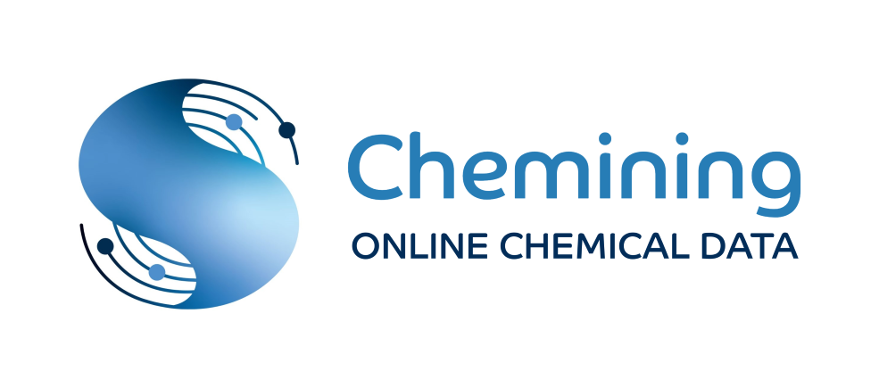

Chemining is an automated and user-friendly tool to retrieve user-selected data from PubChem and ChEBI. 
From only compounds name (SMILES and molecular formula optional) checked by Chemining, identifiers, 
physical-chemical parameters and ontology data are extracted and delivered in Excel format.\
\
Click on the following link to download the installation file ["Chemining_1.0.2-setup.exe"](https://github.com/scannotation/Chemining_software/blob/main/Chemining_1.0.2-setup.exe).\
For more information, view the video tutorial [on YouTube](https://youtu.be/fgq1imKwjuQ) 
or by downloading the file ["Chemining-tutorial.zip"](https://github.com/scannotation/Chemining_software/blob/main/Chemining-tutorial.zip).\
The video is fast, do not hesitate to pause it with the space bar or use a slower pace to read it.

## Development
Chemining was developed in Python 3.9 on Windows 10.

## Tutorial
To get started with Chemining, you can view the tutorial:
* either [on YouTube](https://youtu.be/fgq1imKwjuQ) directly
* or if you want to browse the video using the table of contents (recommended):\
\

\
\
&#x27AA; please download the file ["Chemining-tutorial.zip"](https://github.com/scannotation/Chemining_software/blob/main/Chemining-tutorial.zip)
and launch in your web browser the file "Chemining-tutorial_player.html" present in the zip file.\
The video is fast, do not hesitate to pause it with the space bar or use a slower pace to read it.

## Help and Technical support
If you encounter any problems, please contact the developers at this address: scannotation@ehesp.fr 
or post your issue on this GitHub repository based on the file ["Issue_template.md"](https://github.com/scannotation/Chemining_software/blob/main/Issue_template.md).
